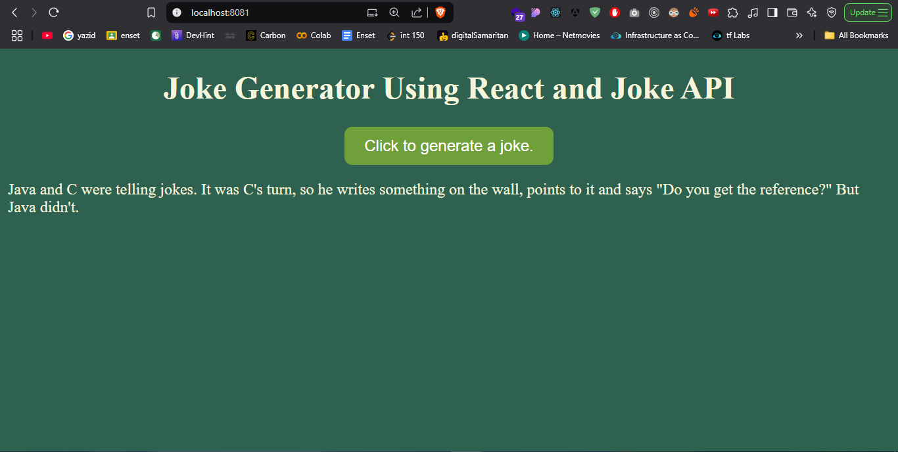

# k8s-config
GitOps repository for managing Kubernetes cluster configurations with ArgoCD. This repository contains declarative YAML manifests for deploying applications, infrastructure components, and ArgoCD App definitions. It ensures version-controlled, automated, and consistent Kubernetes deployments.#### Commands

```bash
# install ArgoCD in k8s
kubectl create namespace argocd
kubectl apply -n argocd -f https://raw.githubusercontent.com/argoproj/argo-cd/stable/manifests/install.yaml

# access ArgoCD UI
kubectl get svc -n argocd
kubectl port-forward svc/argocd-server 8080:443 -n argocd

# login with admin user and below token (as in documentation):
kubectl -n argocd get secret argocd-initial-admin-secret -o jsonpath="{.data.password}" | base64 --decode && echo

# you can change and delete init password

```
</br>




